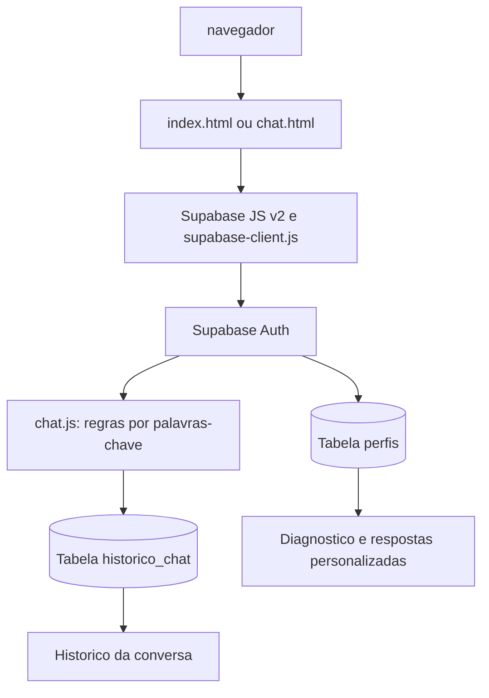
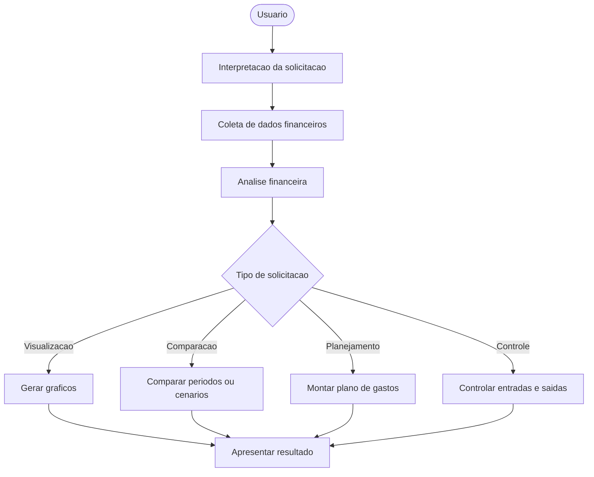

# Documentacao do Sistema

## Visao geral

O Organiza+ e uma aplicacao web de planejamento financeiro pessoal. A pessoa usuaria pode criar uma conta, manter dados financeiros e preferencias de perfil, consultar um diagnostico e conversar com um assistente que sugere respostas com base nesses dados.

A interface usa HTML, CSS e JavaScript no navegador. A autenticacao e os dados de perfil e conversa sao persistidos no Supabase. O chatbot atual e baseado em regras locais; nao usa RASA nem um modelo de IA conectado.

## Funcionalidades implementadas

- Cadastro, login e logout com Supabase Auth.
- Perfil com nome, telefone, perfil de investidor, renda, gastos fixos, foto e imagem de capa.
- Diagnostico financeiro calculado a partir da renda e dos gastos fixos.
- Chat com respostas por palavras-chave para temas como teto de gastos, investimentos, reserva de emergencia e economia.
- Historico de mensagens persistido por usuario no Supabase, com opcao para limpar a conversa.
- Tema claro/escuro, salvo localmente no navegador.

Graficos, comparacoes historicas, controle detalhado de entradas e saidas e processamento por RASA permanecem como propostas, nao como recursos implementados.

## Requisitos e execucao

- Navegador moderno com JavaScript habilitado e acesso a internet.
- Projeto Supabase configurado com Auth, tabelas e politicas de acesso descritas abaixo.
- A aplicacao carrega Supabase JS v2 por CDN.
- Git, caso deseje contribuir com o codigo.

Na raiz do projeto, inicie um servidor HTTP local. Com Python instalado:

```bash
python3 -m http.server 8000
```

Abra `http://localhost:8000`; a pagina inicial e `index.html`. Tambem e possivel usar a extensao Live Server ou outro servidor estatico.

O projeto nao possui servidor proprio nem etapa de build. Como a aplicacao depende do Supabase, abrir os arquivos diretamente com `file://` nao substitui a configuracao e o acesso a rede necessarios.

## Estrutura do projeto

| Arquivo ou pasta | Responsabilidade |
| --- | --- |
| `index.html` | Pagina inicial, cadastro/login e tela de perfil. |
| `script.js` | Autenticacao, perfil, diagnostico, tutorial e interacao com o Supabase. |
| `chat.html` | Estrutura e controles da tela do chatbot. |
| `chat.js` | Carregamento e envio do historico, regras de resposta e interacao do chat. |
| `supabase-client.js` | URL do projeto e inicializacao do cliente Supabase no navegador. |
| `style.css` | Estilos globais, home, cadastro e perfil. |
| `chat.css` | Estilos especificos da interface do chatbot. |
| `img/` | Imagens utilizadas pela interface. |
| `PDF/` | Materiais complementares do projeto. |
| `documentacao.md` | Arquitetura, configuracao e manual tecnico. |

## Fluxo implementado

1. `index.html` e `chat.html` carregam Supabase JS v2, `supabase-client.js` e, em seguida, o script da pagina.
2. O cadastro e o login usam Supabase Auth. Os metadados de cadastro enviados sao nome, telefone e perfil de investidor.
3. A aplicacao consulta o registro da pessoa usuaria na tabela `perfis`. A criacao desse registro deve estar configurada no projeto Supabase, por exemplo, por um trigger associado ao cadastro; este repositorio nao inclui o SQL de configuracao do banco.
4. Edicoes de perfil, valores financeiros e imagens atualizam o registro em `perfis`.
5. O chatbot exige uma sessao autenticada, consulta o perfil e carrega as mensagens de `historico_chat` em ordem cronologica.
6. As mensagens do usuario e as respostas geradas localmente sao gravadas no historico. A acao de limpar conversa exclui as mensagens daquele usuario.



## Supabase e modelo de dados

`supabase-client.js` configura a URL do projeto e uma chave publica `anon`. Essa chave e usada no cliente web e nao deve ser confundida com uma chave `service_role`; nunca coloque uma chave privilegiada no navegador ou no repositorio.

O codigo espera, no minimo, os campos abaixo. Os tipos e restricoes exatos devem ser definidos no projeto Supabase:

| Tabela | Campos utilizados |
| --- | --- |
| `perfis` | `id` (UUID do usuario autenticado), `nome`, `telefone`, `perfil`, `renda`, `gastos_fixos`, `foto`, `capa`, `tutorial_visto`, `updated_at`. |
| `historico_chat` | `user_id`, `remetente`, `texto_html`, `created_at`. |

Configure Row Level Security (RLS) e politicas para que cada usuario autenticado so possa ler e alterar seu proprio registro em `perfis` (`id = auth.uid()`) e seu proprio historico (`user_id = auth.uid()`). Tambem verifique as politicas de insercao e exclusao de mensagens. A chave `anon` nao substitui essas regras.

Fotos e capas sao processadas no navegador e gravadas como data URL nos campos do perfil, nao em um bucket Storage. Considere os limites de tamanho do banco antes de usar imagens maiores.

## Persistencia no navegador

O unico dado da aplicacao gravado diretamente em `localStorage` e a preferencia de tema:

| Chave | Conteudo |
| --- | --- |
| `aurafinance_theme` | Tema selecionado: `light` ou `dark`. |

Contas, sessoes, perfis e historico de chat nao usam as antigas chaves locais `organizamais_usuarios`, `organizamais_sessao` ou `organizamais_chat_<email>`; esses dados agora dependem do Supabase. Para redefinir apenas o tema durante o desenvolvimento, execute no console:

```javascript
localStorage.removeItem('aurafinance_theme');
```

Sair da conta encerra a sessao, mas nao apaga o perfil nem o historico remoto.

## Chat e regras financeiras

O motor de respostas fica em `gerarRespostaFinanceira`, em `chat.js`. Ele procura palavras-chave na mensagem e calcula sugestoes usando o perfil, a renda e os gastos fixos armazenados. As respostas nao sao geradas por um modelo de linguagem.

As configuracoes de perfis de investidor tambem ficam em `chat.js`, no objeto `PERFIS_CONFIG`. Ao alterar os percentuais, valide a regra financeira e teste respostas de teto de gastos, investimentos e reserva de emergencia. Preserve o escape do texto digitado antes de exibi-lo como HTML.

O fluxo com RASA mostrado abaixo e uma referencia conceitual para evolucao do produto; nao representa o caminho executado pelo codigo atual.



## Checklist de testes manuais

- Abrir a home e alternar entre tema claro e escuro; recarregar e verificar a preferencia.
- Criar uma conta valida no Supabase e confirmar o comportamento de verificacao de e-mail configurado no projeto.
- Entrar e sair; confirmar que paginas autenticadas retornam ao login quando nao ha sessao.
- Editar nome, telefone, perfil de investidor, renda e gastos fixos; recarregar e confirmar os dados.
- Atualizar e remover foto e imagem de capa.
- Confirmar a atualizacao do diagnostico apos editar renda ou gastos.
- Enviar uma pergunta pelo botao, por `Enter` e por uma pergunta rapida; testar `Shift + Enter` para quebra de linha.
- Confirmar que mensagens e respostas aparecem apos recarregar o chat.
- Testar respostas de teto de gastos, investimentos, reserva e economia, com e sem dados financeiros preenchidos.
- Limpar o historico e confirmar que ele continua vazio depois de recarregar.
- Verificar o layout em uma janela estreita.

## Limitacoes e seguranca

- A aplicacao depende de internet e de um projeto Supabase acessivel; falhas de rede ou configuracao afetam login e persistencia.
- O codigo do banco e as politicas RLS nao estao incluidos neste repositorio e precisam ser configurados separadamente.
- O chat usa regras e palavras-chave, nao RASA nem um modelo de IA conectado.
- Graficos, comparacoes historicas e controle detalhado de transacoes ainda nao estao implementados.
- O sistema e um prototipo de apoio e nao substitui orientacao financeira profissional.
- A chave `anon` e publica por natureza; a protecao dos dados depende de politicas RLS corretas. Nao publique chaves privilegiadas.
