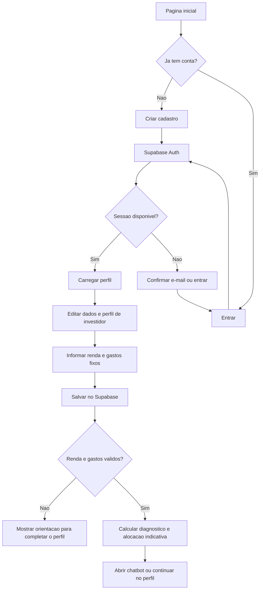
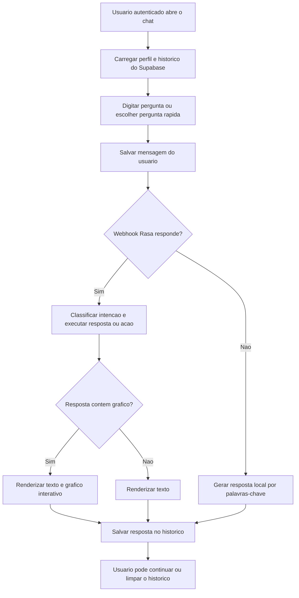

# Documentacao do Sistema

## Visao geral

O Organiza+ e uma aplicacao web de planejamento financeiro pessoal. A pessoa usuaria pode criar uma conta, manter dados financeiros e preferencias de perfil, consultar um diagnostico e conversar com um assistente.

A interface usa HTML, CSS e JavaScript. A autenticacao, os perfis e o historico do chat usam Supabase. O assistente envia mensagens ao Rasa para classificacao de intencoes e execucao de acoes; se o servidor Rasa estiver indisponivel, o chat usa respostas locais por palavras-chave. O projeto nao usa um modelo de linguagem generativo.

## Funcionalidades implementadas

- Cadastro, login e logout com Supabase Auth.
- Perfil com nome, telefone, perfil de investidor, renda, gastos fixos, foto e imagem de capa.
- Diagnostico financeiro calculado a partir da renda e dos gastos fixos.
- Diagnostico financeiro calculado de acordo com renda, gastos fixos e perfil de investidor.
- Chat integrado ao Rasa para saudacao, teto de gastos, investimentos, reserva, economia, simulacoes, comparativos, conceitos e avaliacao de compras.
- Graficos interativos de orcamento, alocacao de investimentos e projecao de poupanca, com opcao de baixar a imagem.
- Historico de mensagens persistido por usuario no Supabase, com opcao para limpar a conversa.
- Tema claro/escuro, salvo localmente no navegador.
- Tutorial guiado do perfil, exibido no primeiro acesso e disponivel para revisao.

O sistema nao mantem um livro de transacoes nem compara historico financeiro entre periodos. As simulacoes sao estimativas e nao representam uma garantia de rendimento.

## Requisitos e execucao

- Navegador moderno com JavaScript habilitado e acesso a internet.
- Projeto Supabase configurado com Auth, tabelas e politicas de acesso descritas abaixo.
- A aplicacao carrega Supabase JS v2 por CDN.
- Git, caso deseje contribuir com o codigo.

Na raiz do repositorio, sirva a pasta da aplicacao. Com Python instalado:

```bash
python3 -m http.server 8000 --directory "Organiza Mais"
```

Abra `http://localhost:8000`; a pagina inicial e `index.html`. Tambem e possivel abrir a pasta `Organiza Mais` no VS Code e usar Live Server.

Para habilitar o assistente Rasa, use dois terminais. O ambiente Python local deste workspace fica em `~/.venvs/organiza-rasa` e usa Python 3.10, Rasa 3.6.21 e Rasa SDK 3.6.2. No primeiro terminal:

```bash
cd "Organiza Mais/organiza-rasa"
source ~/.venvs/organiza-rasa/bin/activate
rasa run --enable-api --cors "*" --port 5005
```

No segundo terminal, execute a partir do mesmo diretorio e ambiente:

```bash
cd "Organiza Mais/organiza-rasa"
source ~/.venvs/organiza-rasa/bin/activate
rasa run actions --port 5055
```

Os modelos treinados estao em `organiza-rasa/models/`. Execute `rasa train` nesse diretorio somente quando alterar os dados NLU, as regras, as historias, o dominio ou a configuracao do modelo. O frontend ainda responde com o motor local quando o Rasa nao esta disponivel.

O projeto nao possui servidor proprio nem etapa de build. Como a aplicacao depende do Supabase, abrir os arquivos diretamente com `file://` nao substitui a configuracao e o acesso a rede necessarios.

## Estrutura do projeto

| Arquivo ou pasta | Responsabilidade |
| --- | --- |
| `index.html` | Pagina inicial, cadastro/login e tela de perfil. |
| `script.js` | Autenticacao, perfil, diagnostico, tutorial e interacao com o Supabase. |
| `chat.html` | Estrutura e controles da tela do chatbot. |
| `chat.js` | Carregamento e envio do historico, regras de resposta e interacao do chat. |
| `supabase-client.js` | URL do projeto e inicializacao do cliente Supabase no navegador. |
| `style.css` | Estilos globais, home, cadastro e perfil. |
| `chat.css` | Estilos especificos da interface do chatbot. |
| `img/` | Imagens utilizadas pela interface. |
| `PDF/` | Guias e materiais complementares do projeto. |
| `organiza-rasa/` | Configuracao, dados de treinamento, modelos e acoes personalizadas do Rasa. |
| `README.md` | Inicializacao rapida e visao geral. |
| `documentacao.md` | Arquitetura, configuracao, manual de uso e fluxos. |

## Manual do usuario

### Criar conta e entrar

1. Na pagina inicial, escolha **Criar cadastro** e informe nome, e-mail, telefone, perfil de investidor e senha. A senha deve ter pelo menos seis caracteres.
2. Se o projeto Supabase exigir confirmacao de e-mail, confirme o endereco e depois entre pela aba **Entrar**.
3. O acesso ao perfil e ao chatbot exige uma sessao autenticada. Use **Sair** para encerrar a sessao sem apagar seus dados.

### Completar o perfil e ler o diagnostico

1. Informe nome, telefone e perfil de investidor no formulario de dados pessoais. O e-mail usado no login nao e editavel nessa tela.
2. Informe a renda liquida mensal e o total de gastos fixos. Valores vazios sao aceitos, mas o diagnostico so e calculado quando renda e gastos estao preenchidos e a renda e maior que zero.
3. Salve os dados financeiros para atualizar a margem livre, o teto sugerido para gastos variaveis, a meta de poupanca e a alocacao indicativa.
4. Se os gastos fixos superarem a renda, o diagnostico mostra um alerta. O sistema nao registra cada compra ou conta individual.
5. Foto de perfil e capa sao opcionais. Sao aceitos arquivos de imagem de ate 12 MB; a imagem e redimensionada no navegador antes de ser gravada no perfil. Os botoes **Remover foto** e **Remover capa** apagam a imagem correspondente.
6. O tutorial aparece no primeiro acesso ao perfil. Use **Ver tutorial** para abri-lo novamente; e possivel avancar, voltar, pular ou concluir.

### Usar o chatbot

1. Abra **Chatbot Inteligente** depois de entrar na conta. O chat carrega o perfil e as mensagens anteriores.
2. Escolha uma pergunta rapida ou escreva sobre teto de gastos, investimentos, reserva de emergencia, economia, simulacao, comparativo, conceitos ou uma compra.
3. Pressione **Enter** para enviar. Use **Shift + Enter** para inserir uma quebra de linha.
4. Quando o Rasa esta disponivel, as perguntas passam pelas intencoes e acoes configuradas. Algumas respostas incluem graficos; clique nos segmentos interativos quando houver indicacao e use o botao de download para salvar a imagem.
5. Se a chamada ao Rasa falhar, o chat tenta responder pelo motor local. Esse modo cobre perguntas por palavras-chave, mas nao produz os graficos do Rasa.
6. O historico e salvo por usuario no Supabase. Use **Limpar historico da conversa** e confirme para apagar as mensagens armazenadas. A preferencia de tema pode ser alternada no controle claro/escuro.

## Fluxos do usuario

### Cadastro, perfil e diagnostico



### Conversa e historico



O modelo classifica mensagens no Rasa em `localhost:5005`; as acoes personalizadas usam `localhost:5055`. As acoes financeiras recebem perfil, renda e gastos enviados pelo frontend. As acoes de saudacao e avaliacao de compra consultam o perfil no Supabase pelo ID do usuario e dependem das politicas de acesso dessa tabela.

## Fluxo tecnico

1. `index.html` e `chat.html` carregam Supabase JS v2, `supabase-client.js` e o script da pagina.
2. Cadastro e login usam Supabase Auth. O cadastro envia nome, telefone e perfil de investidor como metadados.
3. O perfil precisa existir na tabela `perfis`; a criacao automatica desse registro, por exemplo via trigger de cadastro, deve estar configurada no Supabase. O SQL nao esta incluido neste repositorio.
4. Edicoes de perfil, valores financeiros, foto e capa atualizam o registro em `perfis`.
5. O chatbot exige sessao autenticada, consulta o perfil e carrega `historico_chat` em ordem cronologica.
6. Mensagens sao enviadas ao webhook REST do Rasa com o ID e os dados financeiros do perfil. Respostas com payload de grafico sao renderizadas pelo Chart.js; falhas na chamada acionam o motor local.
7. Mensagens e respostas sao gravadas em `historico_chat`. A acao de limpar conversa exclui as mensagens do usuario autenticado.

## Supabase e modelo de dados

`supabase-client.js` configura a URL do projeto e uma chave publica `anon`. Essa chave e usada no cliente web e nao deve ser confundida com uma chave `service_role`; nunca coloque uma chave privilegiada no navegador ou no repositorio.

O codigo espera, no minimo, os campos abaixo. Os tipos e restricoes exatos devem ser definidos no projeto Supabase:

| Tabela | Campos utilizados |
| --- | --- |
| `perfis` | `id` (UUID do usuario autenticado), `nome`, `telefone`, `perfil`, `renda`, `gastos_fixos`, `foto`, `capa`, `tutorial_visto`, `updated_at`. |
| `historico_chat` | `user_id`, `remetente`, `texto_html`, `created_at`. |

Configure Row Level Security (RLS) e politicas para que cada usuario autenticado so possa ler e alterar seu proprio registro em `perfis` (`id = auth.uid()`) e seu proprio historico (`user_id = auth.uid()`). Tambem verifique as politicas de insercao e exclusao de mensagens. A chave `anon` nao substitui essas regras.

Fotos e capas sao processadas no navegador e gravadas como data URL nos campos do perfil, nao em um bucket Storage. Considere os limites de tamanho do banco antes de usar imagens maiores.

## Persistencia no navegador

O unico dado da aplicacao gravado diretamente em `localStorage` e a preferencia de tema:

| Chave | Conteudo |
| --- | --- |
| `aurafinance_theme` | Tema selecionado: `light` ou `dark`. |

Contas, sessoes, perfis e historico de chat dependem do Supabase. Para redefinir apenas o tema durante o desenvolvimento, execute no console:

```javascript
localStorage.removeItem('aurafinance_theme');
```

Sair da conta encerra a sessao, mas nao apaga o perfil nem o historico remoto.

## Chat e regras financeiras

`chat.js` envia as mensagens ao endpoint REST do Rasa em `localhost:5005` e encaminha o perfil financeiro junto com a requisicao. O servidor Rasa usa NLU, regras e acoes personalizadas definidas em `organiza-rasa/`; o servidor de acoes escuta em `localhost:5055`.

As acoes de teto, alocacao, reserva, simulacao e comparativo usam os dados do perfil enviados pelo frontend. As acoes de saudacao e avaliacao de compra consultam o perfil no Supabase pelo ID do usuario. Garanta que as politicas de acesso do Supabase permitam as consultas necessarias sem expor uma chave privilegiada.

As acoes podem retornar graficos Chart.js de distribuicao de gastos, alocacao sugerida e projecao de poupanca. A funcao `gerarRespostaFinanceira`, em `chat.js`, e o fallback local: ela procura palavras-chave e nao usa um modelo generativo. Esse fallback nao renderiza os graficos do Rasa.

As configuracoes locais de perfis de investidor ficam em `PERFIS_CONFIG`, em `chat.js`; as regras e respostas processadas pelo Rasa ficam em `organiza-rasa/data/` e `organiza-rasa/actions/actions.py`. Preserve o escape do texto digitado antes de exibi-lo como HTML.

## Checklist de testes manuais

- Abrir a home e alternar entre tema claro e escuro; recarregar e verificar a preferencia.
- Criar uma conta valida no Supabase e confirmar o comportamento de verificacao de e-mail configurado no projeto.
- Entrar e sair; confirmar que paginas autenticadas retornam ao login quando nao ha sessao.
- Editar nome, telefone, perfil de investidor, renda e gastos fixos; recarregar e confirmar os dados.
- Atualizar e remover foto e imagem de capa.
- Confirmar a atualizacao do diagnostico apos editar renda ou gastos.
- Enviar uma pergunta pelo botao, por `Enter` e por uma pergunta rapida; testar `Shift + Enter` para quebra de linha.
- Com os servidores ativos, testar saudacao, teto, alocacao, reserva, economia, simulacao, comparativo, conceitos e avaliacao de compra.
- Conferir graficos interativos e download; depois desligar o Rasa e verificar o fallback local.
- Confirmar que mensagens e respostas aparecem apos recarregar o chat.
- Testar respostas de teto de gastos, investimentos, reserva e economia, com e sem dados financeiros preenchidos.
- Limpar o historico e confirmar que ele continua vazio depois de recarregar.
- Verificar o layout em uma janela estreita.

## Limitacoes e seguranca

- A aplicacao depende de internet e de um projeto Supabase acessivel; falhas de rede ou configuracao afetam login e persistencia.
- O codigo do banco e as politicas RLS nao estao incluidos neste repositorio e precisam ser configurados separadamente.
- As respostas do Rasa e os graficos dependem dos dois servidores locais ativos; o fallback cobre somente as regras por palavras-chave implementadas em JavaScript.
- O sistema nao usa um modelo de linguagem generativo, nao registra transacoes e nao oferece comparacoes entre periodos historicos.
- Algumas acoes Rasa consultam o perfil diretamente no Supabase; erros de acesso a essa tabela podem impedir essas respostas.
- O sistema e um prototipo de apoio e nao substitui orientacao financeira profissional.
- A chave `anon` e publica por natureza; a protecao dos dados depende de politicas RLS corretas. Nao publique chaves privilegiadas.
