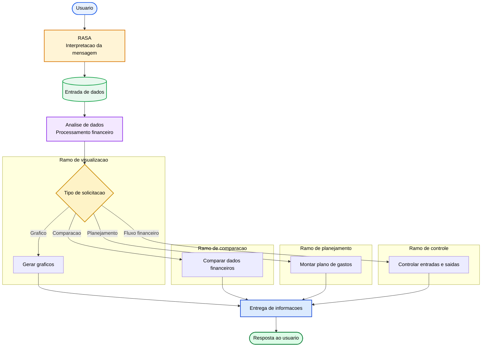
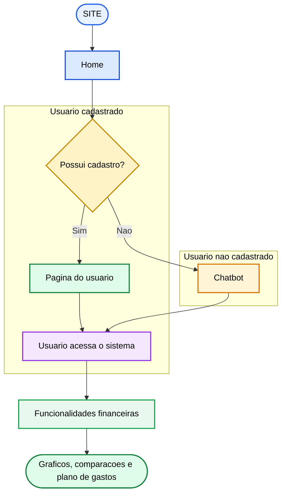

# Documentacao do Sistema

## Proposta do sistema

O sistema sera uma plataforma inteligente de apoio ao planejamento e ao controle financeiro pessoal. A proposta combina um chatbot inteligente com um assistente virtual capaz de interpretar dados financeiros e apresentar informacoes uteis para a tomada de decisoes.

Principais funcionalidades:

- Chatbot inteligente para interacao com o usuario.
- Assistente virtual para orientar o usuario em suas tarefas financeiras.
- Geracao de graficos para facilitar a visualizacao dos dados.
- Comparacoes financeiras entre periodos, categorias ou cenarios.
- Elaboracao de plano de gastos personalizado.
- Controle do fluxo de entradas e saidas financeiras.

## Fluxograma da IA

### Etapas do fluxo

1. **RASA:** recebe e interpreta as mensagens do usuario.
2. **Entrada de dados:** coleta as informacoes necessarias para a solicitacao.
3. **Analise de dados:** processa os dados financeiros e identifica resultados ou padroes.
4. **Entrega de informacoes:** apresenta a resposta, os graficos, as comparacoes ou o plano de gastos ao usuario.

## Jornada do usuario

### Etapas da jornada

1. O usuario acessa o **site**.
2. Na **home**, escolhe como deseja continuar.
3. O sistema verifica se o usuario possui cadastro.
4. Se a resposta for **sim**, o usuario acessa a pagina do usuario.
5. Se a resposta for **nao**, o usuario e direcionado ao chatbot.
6. O usuario interage com o sistema e acessa as funcionalidades financeiras disponiveis.
